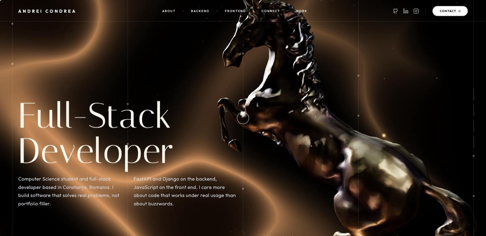

<div align="center">

# Andrei Condrea — Portfolio

**A cinematic, WebGL-driven developer portfolio.** A scroll-jacked 3D bronze horse sequence
blends into a normal-flow, glassmorphic project grid — no frameworks, no build step, no bundler.

[](#)
[](#)
[](#)
[](#)
[](#)

### [🔗 View Live Site](https://andrewtechtips.github.io/Portfolio-Website/)

</div>

<br />



---

## Overview

A single-page portfolio built in two phases that share one continuous scroll:

- **Phase 1 — Hero.** A full 360° scroll-driven camera orbit around a bronze horse statue,
  forge sparks rising through the scene, a hand-written GLSL wave shader breathing in the
  background, and four editorial text slides that reveal per-letter as scroll milestones hit.
- **Phase 2 — Work.** The 3D scene doesn't unmount — it settles into a fixed side profile,
  gets a real-time blur + tint applied to the canvas, and a responsive, filterable project
  grid scrolls in on top of it as a normal document, still floating over the blurred backdrop.

Everything — the renderer, the shader, the scroll physics, the project grid — is hand-written
vanilla JavaScript. The only dependency is Three.js, and it's vendored into the repo rather
than pulled from a CDN (see [Engineering notes](#engineering-notes)).

---

## Features

**3D hero experience**
- Full 360° scroll-jacked camera orbit with eased settle transition into Phase 2
- Custom GLSL background shader (liquid bronze → sapphire, mouse- and scroll-reactive)
- Procedural forge-spark particle system, tuned separately for mobile/desktop
- Per-letter title reveal animation, synced to scroll milestones
- Loading indicator with live progress while the (compressed) 3D model streams in

**Project showcase**
- Fully data-driven from `projects.json` — add one object, get a new card, no HTML/JS edits
- Featured / Other split, with "Other Projects" paginated behind a "Show More" toggle
- Auto-generated language filter bar (adding a project with a new language adds its filter)
- Self-hosted tech-stack icons per card, with an automatic fallback icon for anything new

**Contact**
- Modal contact form via [FormSubmit](https://formsubmit.co) — no backend required
- Honeypot field to filter out basic spam bots without adding friction for real visitors

**Everywhere**
- Custom two-ring cursor on fine-pointer (mouse) devices only, real touch input detected live
- Fully responsive: distinct tuning for desktop, tablet, and mobile (spark count, shadow
  quality, DPR cap, scroll distance)
- Keyboard accessible throughout — skip link, visible focus states, focus-trapped modal/menu

---

## Engineering notes

A few things this project deliberately does *not* leave to chance, since it's meant to be a
sample of how the code is written, not just what it looks like:

| Area | What's done |
|---|---|
| **Dependencies** | Three.js, GLTFLoader, and the meshopt decoder are vendored under `vendor/` — no CDN at runtime, so the whole page can't go dark because a third-party host is slow or blocked. |
| **3D asset size** | The bronze horse model is meshopt-compressed and its texture recompressed to WebP (3.4MB → ~650KB) with zero geometry simplification — same vertex/triangle count, just quantized. |
| **XSS** | Project-card rendering escapes every field pulled from `projects.json` before it touches `innerHTML`, and only `http(s)` URLs are ever rendered as real links. |
| **CSP** | A same-origin `Content-Security-Policy` is enforced via meta tag — inline scripts are blocked by default except one exact, hash-allowlisted block (the import map itself has to be inline per spec). |
| **Images** | Profile photo ships as AVIF → WebP → JPEG via `<picture>`, so every browser gets the smallest format it supports. |
| **Accessibility** | Skip-to-content link, visible `:focus-visible` states, and a real focus trap on the mobile menu and contact modal — not just `Escape`-to-close. |
| **SEO** | Meta description, Open Graph, Twitter Card, canonical URL, `sitemap.xml`, `robots.txt`, and JSON-LD `Person`/`WebSite` structured data. |

---

## Tech stack

| | |
|---|---|
| **Structure & style** | HTML5, CSS3 (Grid, Flexbox, backdrop-filter glassmorphism) |
| **Logic** | Vanilla JavaScript, native ES modules — no bundler, no transpiler |
| **3D / rendering** | [Three.js](https://threejs.org) r185, `GLTFLoader`, meshopt decompression |
| **Data** | Static `projects.json`, fetched at runtime |
| **Forms** | [FormSubmit](https://formsubmit.co) (no backend) |
| **Fonts** | Italiana + Outfit (Google Fonts) |

---

## Project structure

```
Portfolio-Website/
├── index.html                 # Full page markup, meta/SEO tags, CSP
├── main.js                    # Scene setup, scroll physics, project grid, contact modal
├── style.css                  # All styling — layout, responsiveness, animations
├── projects.json              # Project data — single source of truth for the work grid
├── robots.txt
├── sitemap.xml
├── favicon.ico
├── assets/
│   ├── bronze_horse.glb       # Compressed 3D model (meshopt + WebP texture)
│   ├── profile.jpeg / .webp / .avif
│   ├── favicon.svg / -16.png / -32.png / apple-touch-icon.png
│   └── icons/                 # Self-hosted tech-stack icons used on project cards
├── vendor/
│   └── three/                 # Vendored Three.js build + GLTFLoader + meshopt decoder
└── docs/
    └── preview.jpg
```

---

## Getting started

This project uses native ES modules and `fetch()` for `projects.json` and the 3D model, both
of which require an actual HTTP server — opening `index.html` directly (`file://`) will not
work in most browsers.

```bash
git clone https://github.com/AndrewTechTips/Portfolio-Website.git
cd Portfolio-Website

# any static server works, for example:
python3 -m http.server 8000
# or
npx serve .
```

Then open `http://localhost:8000`.

### Adding a project

Append one object to `projects.json` — nothing else needs to change:

```json
{
  "id": "my-new-project",
  "title": "My New Project",
  "description": "What it does, in one or two sentences.",
  "tech": [
    { "name": "python", "type": "language" },
    { "name": "flask", "type": "tool" }
  ],
  "liveUrl": "https://example.com",
  "sourceUrl": "https://github.com/AndrewTechTips/my-new-project",
  "featured": false,
  "priority": 31
}
```

- `featured: true` pins a project to the always-visible "Featured Work" section.
- `priority` orders everything else (lower = earlier); omit it and the project just sorts last.
- `tech[].type` of `"language"` automatically gets a filter button in the filter bar; anything
  else renders as a plain tech pill.
- Tech icons resolve from `assets/icons/<name>.svg`; anything without a matching file falls
  back to a generic icon automatically — no broken images.

---

## Contact

- **LinkedIn:** [Andrei Condrea](https://linkedin.com/in/andrei-condrea-b32148346)
- **GitHub:** [@AndrewTechTips](https://github.com/AndrewTechTips)
- **Instagram:** [@andrew_er_](https://www.instagram.com/andrew_er_)

Or use the contact form on the site itself.
